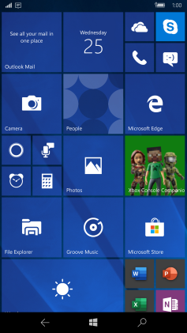
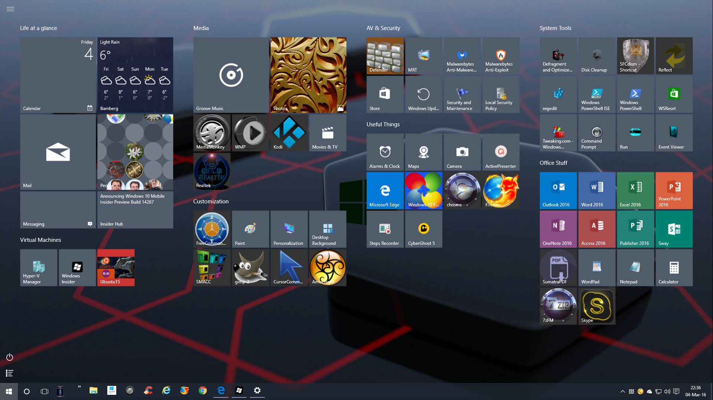

# Fluent Start Page

Windows Phone 7 принесла домашню сторінку у вигляді різнокольорових плиток. Ця концепція проіснувала аж до виходу Windows 11.

<table>
	<tr>
		<td rowspan="2">
			<figure>
				
				<caption>Windows Phone 7</caption>
			</figure>
			<figure>
				
				<caption>Windows Phone 10</caption>
			</figure>
		</td>
		<td>
			<figure>
				
				<caption>Windows 8 / 8.1</caption>
			</figure>
		</td>
	</tr>
	<tr>
		<td>
			<figure>
				
				<caption>Windows 10 (fullscreen)</caption>
			</figure>
		</td>
	</tr>
</table>

Хоча я користуюся Windows 11 та Android як основними операційними системами, я дуже сумую за плитками. Також я часто користуюся стартовою сторінкою браузера для швидкого доступу до сайтів.

І тут виникла ідея зробити стартову сторінку браузера, але яка буде майже *точно* виглядати як Пуск з Windows 10 (тому що вона виглядає краще).

## Нотатки

- Референс для структури даних плиток: <https://learn.microsoft.com/en-us/windows/configuration/start/layout?pivots=windows-10&tabs=intune-10%2Cintune-11#start-layout-example>
- Отримання іконки сайту нативно через браузер (ненадійно, для Chromium браузерів): <https://superuser.com/questions/532616/grab-favicon-ico-using-google-chrome-dev-tools/1443114#1443114>, <https://stackoverflow.com/a/68423764>
